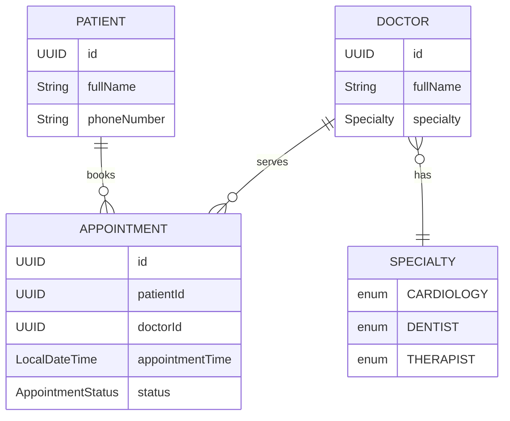
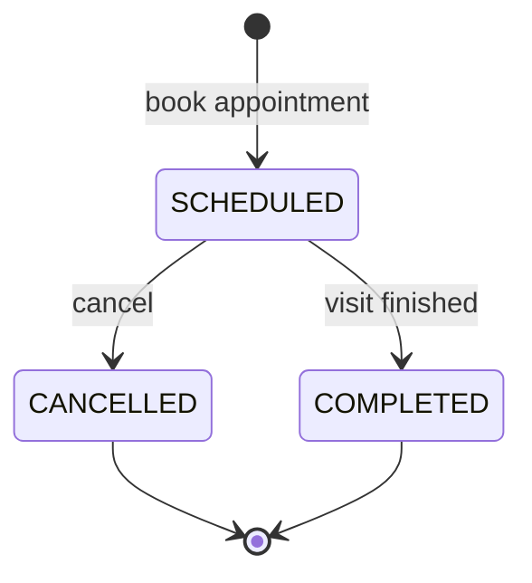
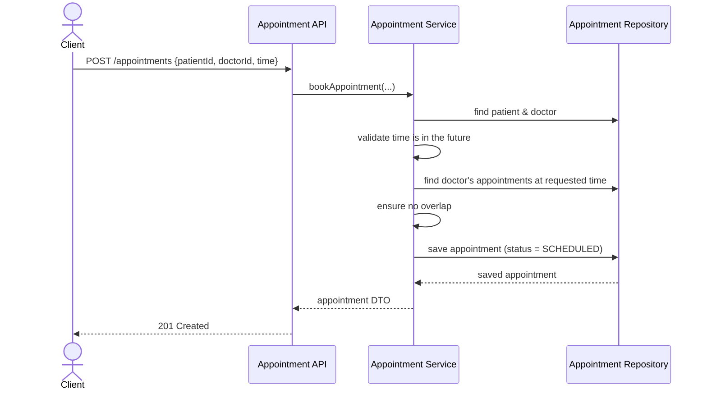
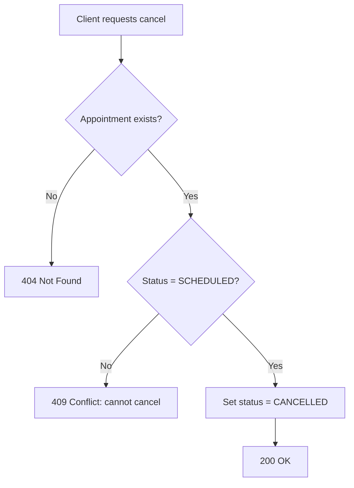

# MediCare — Foundation Flow

This document describes the foundation of the **MediCare** clinic appointment system: its domain, the relationships between entities, the main user flows, and the business rules that the system must enforce.

---

## 1. Purpose

MediCare is a small clinic appointment management system. It lets a clinic register **patients** and **doctors**, and book/cancel **appointments** between them, while enforcing a few core scheduling rules.

---

## 2. Domain Model

The domain has three core entities and one supporting enum.

### 2.1 Entity-Relationship Diagram

### 2.2 Relationships

- One **Doctor** has exactly **one Specialty** (enum value).
- One **Patient** can have **many Appointments**.
- One **Doctor** can have **many Appointments**.
- One **Appointment** belongs to exactly **one Patient** and **one Doctor**.

### 2.3 Appointment Status

An appointment moves through a small state machine:

- `SCHEDULED` — booked, not yet completed or cancelled.
- `CANCELLED` — cancelled by patient/clinic; **terminal**.
- `COMPLETED` — visit has happened; **terminal**.

---

## 3. Core Flows

### 3.1 Book an Appointment

The most important flow. It is also where most business rules are enforced.

### 3.2 Cancel an Appointment

### 3.3 Complete an Appointment

- **Endpoint:** `POST /v1/appointments/{id}/complete`
- Only appointments in **`SCHEDULED`** may be completed; response is **409 Conflict** if the appointment is already **CANCELLED** or **COMPLETED**.
- On success the status becomes **`COMPLETED`** (**terminal**).

### 3.4 List Appointments by Date / Doctor Schedule

- **By date** — query all appointments where `appointmentTime` falls within the given calendar day (in the JVM default time zone).
- **Doctor schedule** — query all appointments for a given `doctorId`, optionally filtered by date range, ordered by `appointmentTime`.
- **Patient appointments** — same optional filters on `GET /v1/patients/{id}/appointments`.
- **Clinic-wide list** — `GET /v1/appointments` returns full `AppointmentDTO` rows (patient and doctor embedded), ordered by `appointmentTime` ascending.

**Query parameters** (all optional; filters are combined with **AND**):

| Parameter | Meaning |
|-----------|---------|
| `status` | Repeat the parameter for multiple values, e.g. `status=SCHEDULED&status=COMPLETED`. Omit entirely to ignore status. |
| `date` | ISO calendar date (`YYYY-MM-DD`). Matches appointments from start-of-day through end-of-day in the JVM default zone. |
| `from` | Inclusive lower bound on `appointmentTime` as **UTC** `Instant` (ISO-8601, e.g. `2026-05-14T00:00:00Z`). Converted to `LocalDateTime` using the JVM default zone for comparison with stored times. |
| `to` | Inclusive upper bound on `appointmentTime`, same format and zone rules as `from`. |

`from` must not be after `to` when both are present (otherwise the API returns **400 Bad Request**).

### 3.5 View Patient Appointments

Query all appointments for a given `patientId`, ordered by `appointmentTime` ascending (upcoming first). The same optional query parameters as in §3.4 apply on `GET /v1/patients/{id}/appointments`.

### 3.6 Delete Patient or Doctor

| Method | Path | Success | Missing entity |
|--------|------|---------|----------------|
| `DELETE` | `/v1/patients/{id}` | **200 OK** with envelope message `Patient deleted successfully.` | **404** `Patient not found.` |
| `DELETE` | `/v1/doctors/{id}` | **200 OK** with envelope message `Doctor deleted successfully.` | **404** `Doctor not found.` |

**Related appointments (product rule):** deleting a patient or doctor performs a **hard delete** of that entity and **cascade-deletes every appointment** that referenced them (all statuses). The API does not orphan appointment rows.

---

## 4. Business Rules

These are invariants the service layer must enforce. They are independent of the storage technology.

| # | Rule | Where enforced |
|---|------|----------------|
| 1 | A doctor cannot have **overlapping appointments** | `AppointmentService.book(...)` |
| 2 | An appointment time **cannot be in the past** | `AppointmentService.book(...)` |
| 3 | A **cancelled appointment cannot be completed** | `CompleteAppointmentUseCase` |
| 4 | A **cancelled or completed appointment cannot be cancelled again** | `AppointmentService.cancel(...)` |
| 5 | A doctor must have a **specialty** assigned | `DoctorService.create(...)` |
| 6 | Deleting a **patient** or **doctor** **cascade-deletes** all appointments that reference them | `DeletePatientUseCase`, `DeleteDoctorUseCase` |

> Rule #1 currently treats "overlap" as **same `appointmentTime` for the same doctor**. If appointment durations are introduced later, this rule should evolve into a real time-range overlap check.

---
