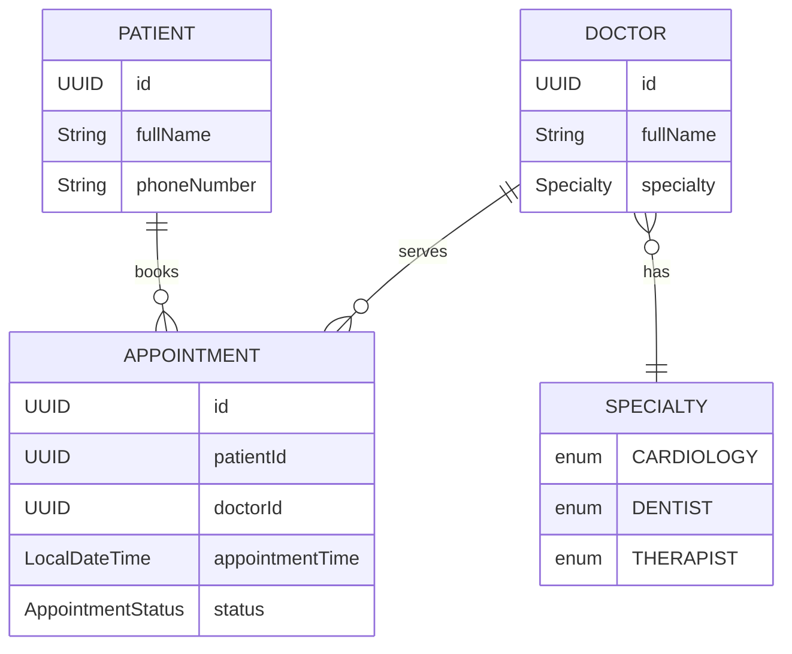
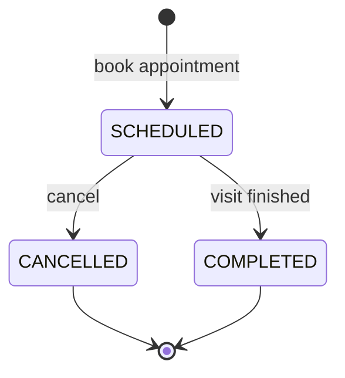
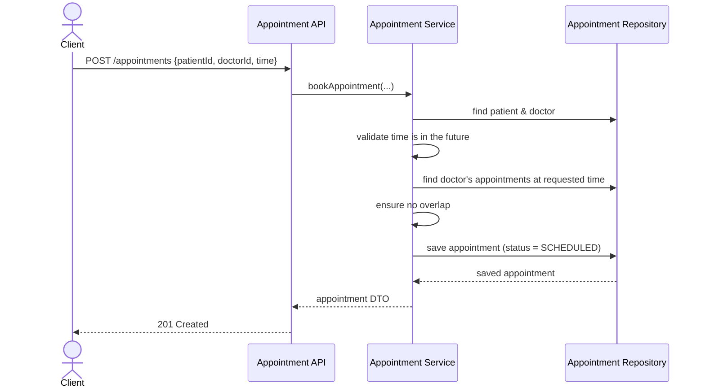
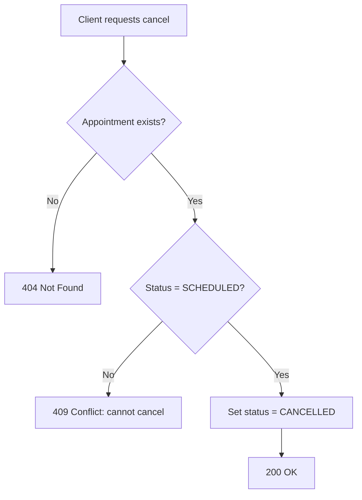

# MediCare — Foundation Flow

This document describes the foundation of the **MediCare** clinic appointment system: its domain, the relationships between entities, the main user flows, and the business rules that the system must enforce.

---

## 1. Purpose

MediCare is a small clinic appointment management system. It lets a clinic register **patients** and **doctors**, and book/cancel **appointments** between them, while enforcing a few core scheduling rules.

---

## 2. Domain Model

The domain has three core entities and one supporting enum.

### 2.1 Entity-Relationship Diagram

### 2.2 Relationships

- One **Doctor** has exactly **one Specialty** (enum value).
- One **Patient** can have **many Appointments**.
- One **Doctor** can have **many Appointments**.
- One **Appointment** belongs to exactly **one Patient** and **one Doctor**.

### 2.3 Appointment Status

An appointment moves through a small state machine:

- `SCHEDULED` — booked, not yet completed or cancelled.
- `CANCELLED` — cancelled by patient/clinic; **terminal**.
- `COMPLETED` — visit has happened; **terminal**.

---

## 3. Core Flows

### 3.1 Book an Appointment

The most important flow. It is also where most business rules are enforced.

### 3.2 Cancel an Appointment

### 3.3 List Appointments by Date / Doctor Schedule

- **By date** — query all appointments where `appointmentTime` falls within the given day.
- **Doctor schedule** — query all appointments for a given `doctorId`, optionally filtered by date range, ordered by `appointmentTime`.

### 3.4 View Patient Appointments

Query all appointments for a given `patientId`, ordered by `appointmentTime` (most recent first or upcoming first, depending on the use case).

---

## 4. Business Rules

These are invariants the service layer must enforce. They are independent of the storage technology.

| # | Rule | Where enforced |
|---|------|----------------|
| 1 | A doctor cannot have **overlapping appointments** | `AppointmentService.book(...)` |
| 2 | An appointment time **cannot be in the past** | `AppointmentService.book(...)` |
| 3 | A **cancelled appointment cannot be completed** | `AppointmentService.complete(...)` |
| 4 | A **cancelled or completed appointment cannot be cancelled again** | `AppointmentService.cancel(...)` |
| 5 | A doctor must have a **specialty** assigned | `DoctorService.create(...)` |

> Rule #1 currently treats "overlap" as **same `appointmentTime` for the same doctor**. If appointment durations are introduced later, this rule should evolve into a real time-range overlap check.

---
