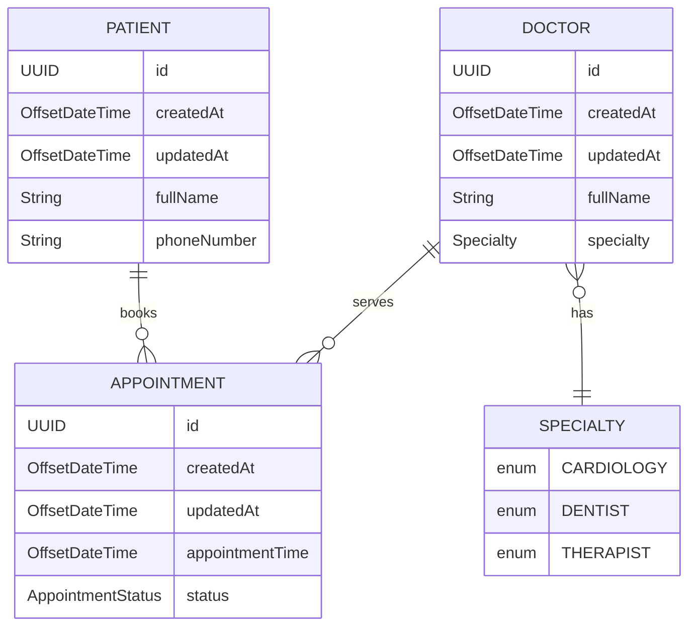
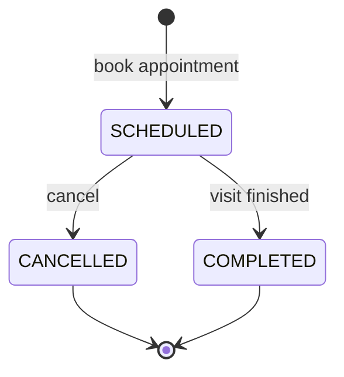
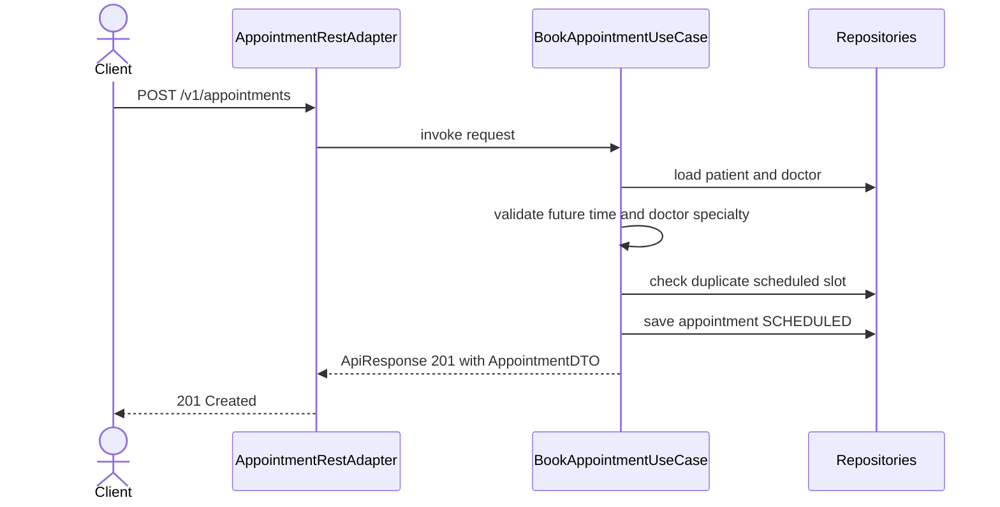
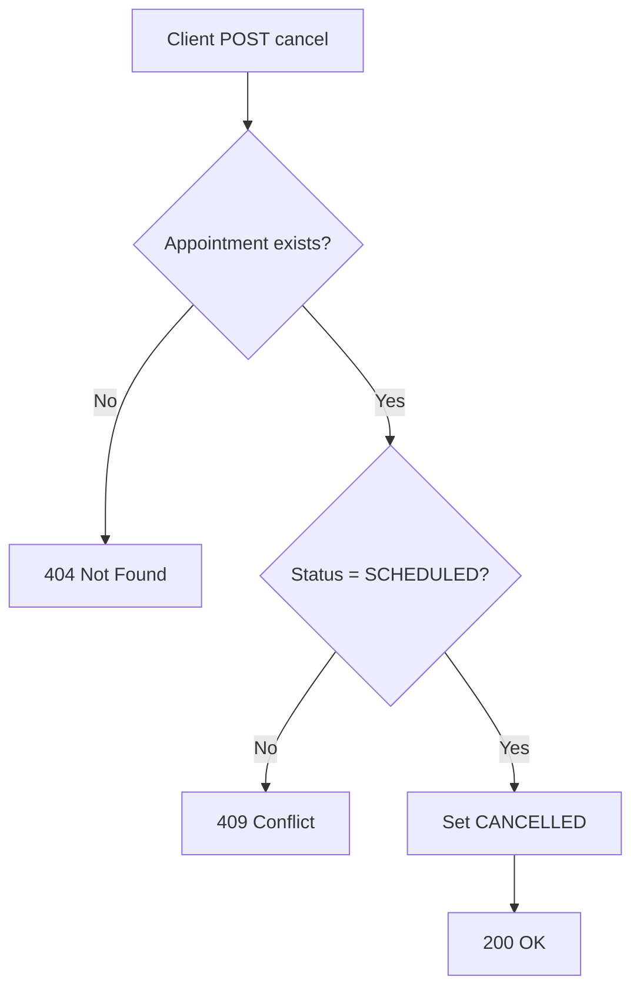

# MediCare — System Flow

This document is the human-readable contract for **MediCare**: domain model, HTTP behaviour, main flows, and business rules the application enforces today.

---

## 1. Purpose

MediCare is a small clinic appointment system. A clinic registers **patients** and **doctors**, books **appointments** between them, and can cancel or complete visits while a few scheduling rules are enforced.

---

## 2. Domain model

The domain has three JPA entities, one supporting enum, and a shared persistence base.

### 2.1 Auditing and identifiers

All entities extend **`BaseEntity`** (`@MappedSuperclass`): **`id`** (UUID, JPA-generated), **`createdAt`** / **`updatedAt`** (`OffsetDateTime`, Hibernate `@CreationTimestamp` / `@UpdateTimestamp`). Read-side DTOs expose the same audit fields via **`BaseDto`**.

### 2.2 Entity–relationship diagram

### 2.3 Relationships

- One **Doctor** has at most **one Specialty** (enum); it may be unset until assigned via the API.
- One **Patient** can have **many Appointments**.
- One **Doctor** can have **many Appointments**.
- One **Appointment** belongs to exactly **one Patient** and **one Doctor**.

### 2.4 Appointment status

- `SCHEDULED` — booked, not yet completed or cancelled.
- `CANCELLED` — cancelled; **terminal**.
- `COMPLETED` — visit finished; **terminal**.

---

## 3. HTTP surface (summary)

All REST paths are under **`/v1`**. Successful and error bodies use the **`ApiResponse`** envelope (status, message, optional `data`, optional `errorCode`, **`OffsetDateTime` timestamp**).

| Concern | Method | Path |
|--------|--------|------|
| List patients | `GET` | `/v1/patients` |
| Create patient | `POST` | `/v1/patients` |
| Delete patient | `DELETE` | `/v1/patients/{id}` |
| Patient’s appointments | `GET` | `/v1/patients/{id}/appointments` |
| List doctors | `GET` | `/v1/doctors` |
| Create doctor | `POST` | `/v1/doctors` |
| Assign specialty | `PATCH` | `/v1/doctors/{id}/specialty` |
| Delete doctor | `DELETE` | `/v1/doctors/{id}` |
| Doctor’s appointments | `GET` | `/v1/doctors/{id}/appointments` |
| List appointments (clinic-wide) | `GET` | `/v1/appointments` |
| Book appointment | `POST` | `/v1/appointments` |
| Cancel appointment | `POST` | `/v1/appointments/{id}/cancel` |
| Complete appointment | `POST` | `/v1/appointments/{id}/complete` |

---

## 4. Core flows

### 4.1 Book an appointment

Most rules are enforced here. Request body includes **`patientId`**, **`doctorId`**, and **`appointmentTime`** as **`OffsetDateTime`**.

### 4.2 Cancel an appointment

### 4.3 Complete an appointment

- **Endpoint:** `POST /v1/appointments/{id}/complete`
- Only **`SCHEDULED`** appointments may be completed; **`CANCELLED`** or **`COMPLETED`** yields **409 Conflict**.
- Success sets status to **`COMPLETED`**.

### 4.4 List and filter appointments

Optional query parameters (combined with **AND**): `status` (repeatable), `date` (`YYYY-MM-DD`, full calendar day in the **JVM default zone**), `from` / `to` (inclusive bounds on **`appointmentTime`** as **`OffsetDateTime`**).

| Parameter | Meaning |
|-----------|---------|
| `status` | Repeat for multiple values, e.g. `status=SCHEDULED&status=COMPLETED`. Omit to ignore. |
| `date` | Calendar day; matches `[startOfDay, nextDay)` in the default zone. |
| `from` | Inclusive lower bound, e.g. `2026-05-14T00:00:00Z`. |
| `to` | Inclusive upper bound; same style as `from`. |

If both `from` and `to` are present, `from` must not be after `to` (**400 Bad Request**).

- **`GET /v1/appointments`** — full **`AppointmentDTO`** (patient and doctor embedded), sorted by **`appointmentTime`** ascending.
- **`GET /v1/doctors/{id}/appointments`** — **`DoctorAppointmentDTO`** list (no nested doctor), same filters and sort.
- **`GET /v1/patients/{id}/appointments`** — **`PatientAppointmentDTO`** list (no nested patient), same filters and sort.

### 4.5 Delete patient or doctor

| Method | Path | Success | Missing entity |
|--------|------|---------|----------------|
| `DELETE` | `/v1/patients/{id}` | **200 OK**, message `Patient deleted successfully.` | **404** `Patient not found.` |
| `DELETE` | `/v1/doctors/{id}` | **200 OK**, message `Doctor deleted successfully.` | **404** `Doctor not found.` |

**Appointments:** deletes call **`AppointmentRepository.deleteByPatient_Id`** / **`deleteByDoctor_Id`** before removing the parent row so no orphan appointments remain.

---

## 5. Business rules

Invariants enforced in the application layer (storage-agnostic wording):

| # | Rule | Where enforced |
|---|------|----------------|
| 1 | A doctor cannot have another **SCHEDULED** appointment at the **same** **`appointmentTime`** | `BookAppointmentUseCase` |
| 2 | **`appointmentTime`** must be **strictly in the future** at booking (using the injected **`Clock`**) | `BookAppointmentUseCase` |
| 3 | Only **`SCHEDULED`** appointments may be **completed** | `CompleteAppointmentUseCase` |
| 4 | Only **`SCHEDULED`** appointments may be **cancelled** | `CancelAppointmentUseCase` |
| 5 | Booking requires the doctor to have a **non-null specialty** | `BookAppointmentUseCase` |
| 6 | Deleting a **patient** or **doctor** removes **all** of their appointments first | `DeletePatientUseCase`, `DeleteDoctorUseCase` |
| 7 | **Duplicate doctor full name** is rejected on create | `CreateDoctorUseCase` |

> Rule **#1** is “same instant for same doctor,” not a duration overlap. If visit lengths are introduced later, this should become a real interval overlap check.

---
